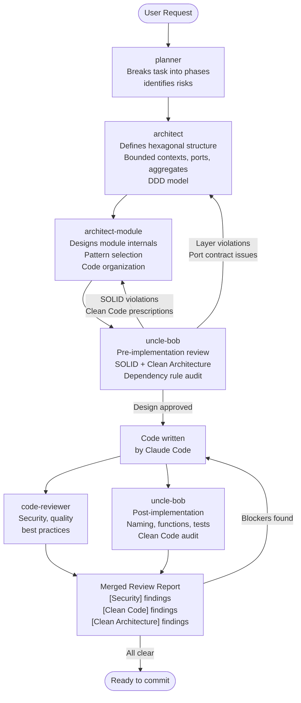
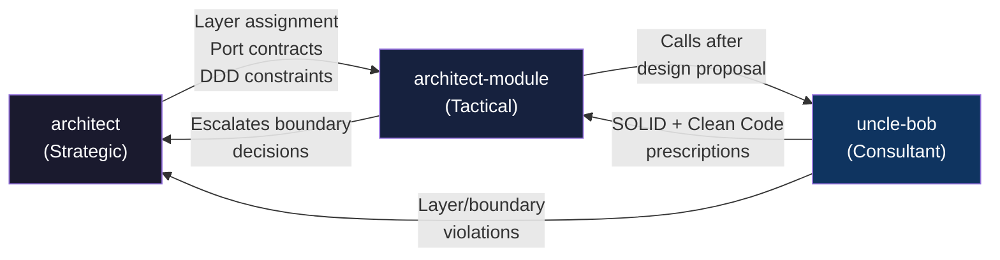
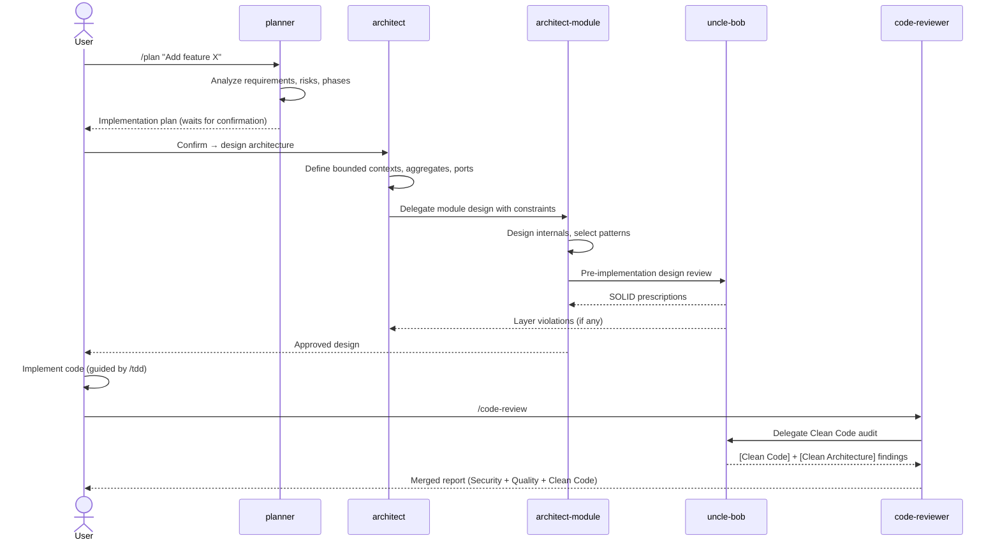
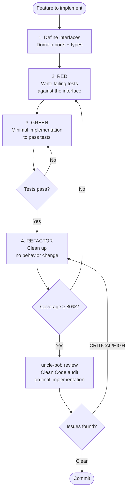
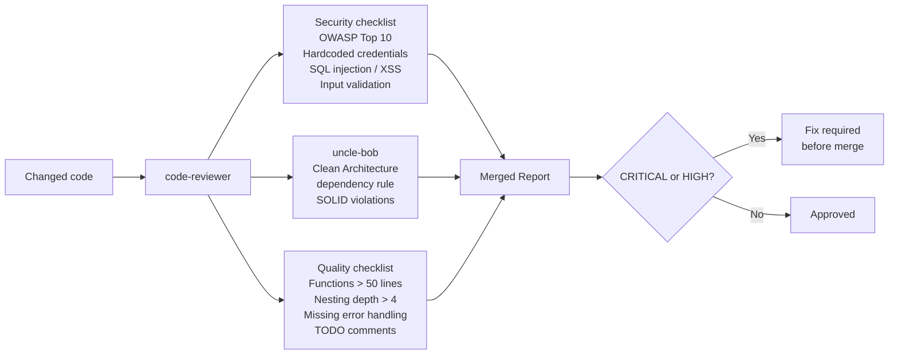
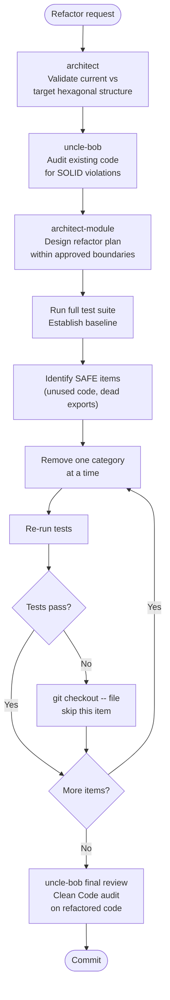

# Everything Claude Code — Personal Fork

> Forked from [affaan-m/everything-claude-code](https://github.com/affaan-m/everything-claude-code) by [@affaanmustafa](https://x.com/affaanmustafa) — Anthropic Hackathon Winner.
> This fork is customized for personal use with Hexagonal Architecture, DDD, and Clean Code enforcement added on top of the original system.

[](LICENSE)

---

## What This Is

A Claude Code plugin — a collection of production-ready agents, skills, hooks, commands, and rules for software development. This fork adds an opinionated architecture layer on top of the upstream:

- **Hexagonal Architecture + DDD** enforced by a strategic architect agent
- **Clean Architecture + Clean Code** enforced by an Uncle Bob consultant agent
- **Module-level design** handled by a dedicated module architect agent

---

## Repository Structure

```
everything-claude-code/
│
├── agents/                          # Specialized subagents for delegation
│   ├── architect.md                 # ★ Hexagonal Architecture + DDD enforcer (system-level)
│   ├── architect-module.md          # ★ Module-level design within hexagonal boundaries
│   ├── uncle-bob.md                 # ★ Clean Architecture + Clean Code consultant
│   ├── planner.md                   # Feature planning, risk assessment, phase breakdown
│   ├── code-reviewer.md             # Security, quality, and Clean Code review
│   ├── tdd-guide.md                 # Test-driven development workflow
│   ├── security-reviewer.md         # OWASP / vulnerability analysis
│   ├── refactor-cleaner.md          # Dead code detection and safe removal
│   └── doc-updater.md               # Documentation sync
│
├── skills/                          # Domain knowledge invoked by agents or commands
│   ├── tdd-workflow/
│   ├── security-review/
│   ├── backend-patterns/
│   ├── frontend-patterns/
│   ├── continuous-learning/
│   ├── autonomous-loops/
│   └── ...50+ more
│
├── commands/                        # Slash commands (/plan, /tdd, /code-review, ...)
│   ├── plan.md
│   ├── tdd.md
│   ├── code-review.md
│   ├── build-fix.md
│   ├── e2e.md
│   ├── refactor-clean.md
│   └── ...30+ more
│
├── rules/                           # Always-follow guidelines (copy to ~/.claude/rules/)
│   ├── common/                      # Language-agnostic — always install
│   │   ├── coding-style.md
│   │   ├── git-workflow.md
│   │   ├── testing.md
│   │   ├── security.md
│   │   └── agents.md
│   ├── typescript/
│   ├── python/
│   └── golang/
│
├── hooks/                           # Trigger-based automations
│   └── hooks.json                   # PreToolUse, PostToolUse, Stop, SessionStart events
│
├── scripts/                         # Cross-platform Node.js hook implementations
│   ├── lib/
│   │   ├── utils.js
│   │   └── package-manager.js
│   └── hooks/
│       ├── session-start.js
│       ├── session-end.js
│       └── evaluate-session.js
│
├── contexts/                        # Dynamic system prompt injection
│   ├── dev.md
│   ├── review.md
│   └── research.md
│
├── mcp-configs/
│   └── mcp-servers.json             # GitHub, Supabase, Vercel, Railway, ...
│
├── examples/                        # CLAUDE.md templates for real-world stacks
│   ├── saas-nextjs-CLAUDE.md
│   ├── go-microservice-CLAUDE.md
│   └── django-api-CLAUDE.md
│
└── tests/
    └── run-all.js
```

> ★ = added or heavily modified in this fork

---

## Agent Orchestration

### Full Development Flow



### Architecture Agent Chain



### Responsibilities Split

| Agent | Scope | Enforces |
|---|---|---|
| **architect** | System-wide | Hexagonal Architecture, DDD strategic (bounded contexts, aggregates, ports) |
| **architect-module** | Single layer/module | Module internals, pattern selection, code efficiency |
| **uncle-bob** | Design + code | SOLID, Clean Architecture dependency rule, Clean Code (naming, functions, tests) |
| **planner** | Feature scope | Implementation phases, risk assessment |
| **code-reviewer** | Changed code | Security, quality, regressions |

---

## Complex Task Flows

### Feature Development (Full Lifecycle)



### TDD Workflow



### Security Review Flow



### Refactoring Flow



---

## Key Concepts

### Agents

Subagents handle delegated tasks with limited scope. Defined as Markdown with YAML frontmatter:

```markdown
---
name: architect
description: Strategic architect enforcing Hexagonal Architecture and DDD...
tools: ["Read", "Grep", "Glob", "Agent"]
model: opus
---
```

### Skills

Domain knowledge invoked by commands or agents. Markdown files describing when to use, how it works, examples:

```
skills/tdd-workflow/SKILL.md
skills/security-review/SKILL.md
skills/backend-patterns/SKILL.md
```

### Hooks

Automated triggers on tool events (`PreToolUse`, `PostToolUse`, `Stop`, `SessionStart`):

```json
{
  "matcher": "tool == \"Edit\"",
  "hooks": [{
    "type": "command",
    "command": "node scripts/hooks/post-edit.js"
  }]
}
```

### Rules

Always-follow guidelines, installed to `~/.claude/rules/`:

```
rules/common/          # Language-agnostic (always install)
rules/typescript/      # TS/JS specific
rules/python/          # Python specific
rules/golang/          # Go specific
```

---

## Installation

```bash
# Clone
git clone <this-repo>
cd everything-claude-code

# Copy agents
cp agents/*.md ~/.claude/agents/

# Copy rules (common + your stack)
cp -r rules/common/* ~/.claude/rules/
cp -r rules/typescript/* ~/.claude/rules/   # pick your stack

# Copy commands
cp commands/*.md ~/.claude/commands/

# Copy skills (selective — only what you need)
cp -r skills/tdd-workflow ~/.claude/skills/
cp -r skills/security-review ~/.claude/skills/
cp -r skills/backend-patterns ~/.claude/skills/
```

Or use the installer:

```bash
./install.sh typescript    # installs common + typescript rules
```

---

## Key Commands

| Command | What it does | Agents involved |
|---|---|---|
| `/plan` | Implementation plan, risks, phases | planner |
| `/tdd` | Test-driven development workflow | tdd-guide |
| `/code-review` | Security + quality review | code-reviewer + uncle-bob |
| `/build-fix` | Fix build errors | build-error-resolver |
| `/e2e` | Generate + run E2E tests | e2e-runner |
| `/refactor-clean` | Remove dead code safely | refactor-cleaner |
| `/verify` | Run verification loop | — |
| `/learn` | Extract patterns from session | — |

---

## Running Tests

```bash
node tests/run-all.js
```

---

## Credits

Original project: **[affaan-m/everything-claude-code](https://github.com/affaan-m/everything-claude-code)** by [@affaanmustafa](https://x.com/affaanmustafa).
Built from an Anthropic Hackathon winner. 50K+ stars, 30+ contributors, 6 languages supported.

Guides from the original author:
- [Shorthand Guide](https://x.com/affaanmustafa/status/2012378465664745795) — setup, foundations, philosophy
- [Longform Guide](https://x.com/affaanmustafa/status/2014040193557471352) — token optimization, memory, evals, parallelization

---

## License

MIT
