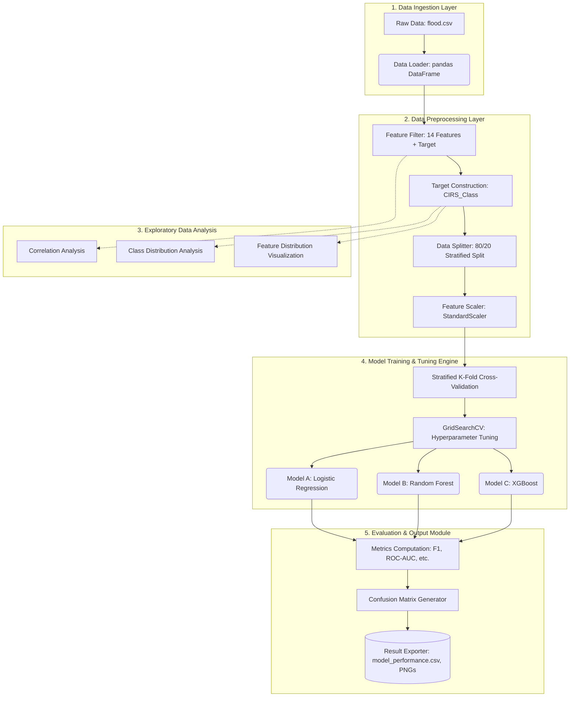

# Flood Risk Prediction System Architecture

Based on the provided Jupyter Notebook pipeline, the system architecture for predicting flood probabilities is structured into five distinct layers:

## System Architecture Diagram

## 1. Data Ingestion Layer
*   **Component:** Data Loader
*   **Function:** Loads the raw flood dataset (`flood.csv`) into a structured pandas DataFrame.
*   **Technologies:** Python, pandas.

## 2. Data Preprocessing Layer
*   **Component 1:** Feature Filter
    *   **Function:** Selects 14 relevant predictive features (e.g., `MonsoonIntensity`, `TopographyDrainage`, `Urbanization`, etc.) and the target variable (`FloodProbability`).
*   **Component 2:** Target Variable Construction
    *   **Function:** Transforms the continuous `FloodProbability` into a categorical `CIRS_Class` (Critical Infrastructure Risk Score). It uses tertile boundaries (33.33rd and 66.67th percentiles) to create three discrete classes:
        *   `0` (Low)
        *   `1` (Medium)
        *   `2` (High)
*   **Component 3:** Data Splitter
    *   **Function:** Partitions the data into training (80%) and testing (20%) sets using a stratified split based on the `CIRS_Class` to ensure class balance across splits.
*   **Component 4:** Feature Scaler
    *   **Function:** Normalizes feature distributions using standardization (`StandardScaler`). The scaler is fitted only on the training data to prevent data leakage and applied to both training and test sets.
*   **Technologies:** pandas, scikit-learn (`train_test_split`, `StandardScaler`).

## 3. Exploratory Data Analysis (EDA) Module
*   **Component 1:** Correlation Analysis
    *   **Function:** Generates a correlation heatmap of the isolation risk features to identify linear relationships.
*   **Component 2:** Class Distribution Analysis
    *   **Function:** Visualizes the distribution of the target variable using bar and pie charts.
*   **Component 3:** Feature Distribution Visualization
    *   **Function:** Plots Kernel Density Estimates (KDE) for each feature, broken down by `CIRS_Class`, to observe class separation capabilities.
*   **Technologies:** matplotlib, seaborn, numpy.

## 4. Model Training & Tuning Engine
*   **Cross-Validation Strategy:** Stratified K-Fold Cross-Validation (5 splits) to ensure reliable performance estimates across imbalanced or representative folds.
*   **Optimization:** Hyperparameter tuning via `GridSearchCV` using a weighted F1-score optimization metric.
*   **Models:**
    *   **Model A:** Logistic Regression (Baseline model; tuned parameter: `C` inverse regularization strength).
    *   **Model B:** Random Forest Classifier (Ensemble tree model; tuned parameters: `n_estimators`, `max_depth`, `min_samples_split`).
    *   **Model C:** XGBoost Classifier (Gradient boosted trees; tuned parameters: `n_estimators`, `max_depth`, `learning_rate` with a multi-class objective).
*   **Technologies:** scikit-learn (`LogisticRegression`, `RandomForestClassifier`, `GridSearchCV`, `StratifiedKFold`), XGBoost (`XGBClassifier`).

## 5. Evaluation & Output Module
*   **Component 1:** Metrics Computation
    *   **Function:** Calculates comprehensive classification metrics for each tuned model on the test set, including:
        *   Accuracy
        *   Precision (Weighted)
        *   Recall (Weighted)
        *   F1-Score (Weighted and Macro)
        *   ROC-AUC (One-vs-Rest, Weighted)
*   **Component 2:** Confusion Matrix Generator
    *   **Function:** Creates row-normalized percentage confusion matrices for all models to analyze misclassification rates between the Low, Medium, and High classes.
*   **Component 3:** Result Exporter
    *   **Function:** Compiles model performance into a structured DataFrame, sorts it by weighted F1-score, and exports it to a CSV file (`model_performance.csv`). Visual outputs (heatmaps, distributions, confusion matrices) are saved as PNG files.
*   **Technologies:** scikit-learn (metrics module), pandas, matplotlib, seaborn.
