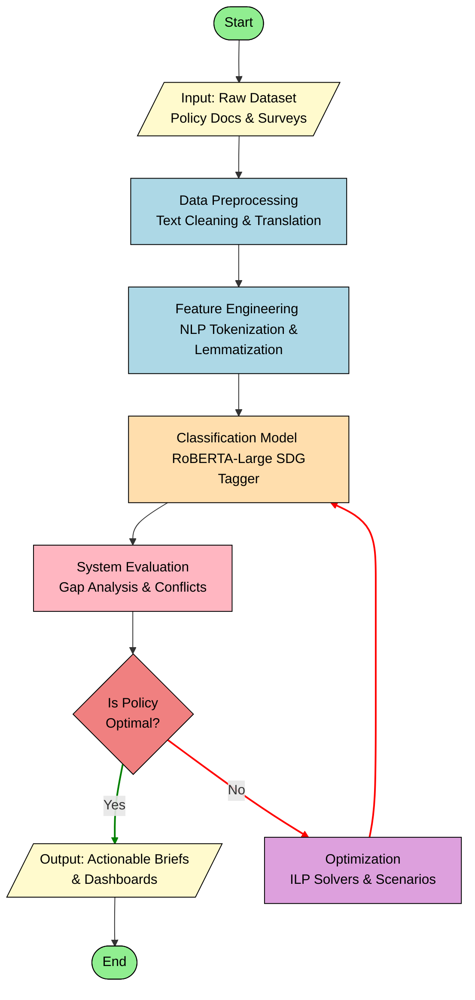

# System Architecture Flowchart

This diagram represents the end-to-end machine learning and optimization pipeline for analyzing and optimizing Sustainable Development Goals (SDGs) in policy documents, as derived from the provided Google Colab notebook.

## Flowchart Description

1. **Start**: The beginning of the pipeline.
2. **Input Data**: Raw datasets containing policy documents and surveys from NGOs and community feedback.
3. **Data Preprocessing**: Initial text cleaning, dealing with missing values, and translating diverse African languages into a common language (English).
4. **Feature Engineering**: NLP normalization and tokenization using NLTK to prepare the text for the classification model.
5. **Model Application**: Using a multi-label classification model (RoBERTA-Large) to map text segments to their relevant SDGs.
6. **System Evaluation**: Analyzing the SDG distributions, performing gap analysis, and detecting any policy conflicts or trade-offs.
7. **Decision Point (Is Policy Optimal?)**: Evaluating whether the current policy coverage meets the required thresholds and has no conflicts.
8. **Optimization**: If not optimal, applying Integer Linear Programming (ILP) solvers (like Branch-and-Bound) to iteratively formulate what-if scenarios and optimize the policy coverage.
9. **Output**: Once optimized, presenting the final predictions and recommendations via interactive dashboards and policy briefs.
10. **End**: The conclusion of the pipeline.

## Mermaid Diagram

