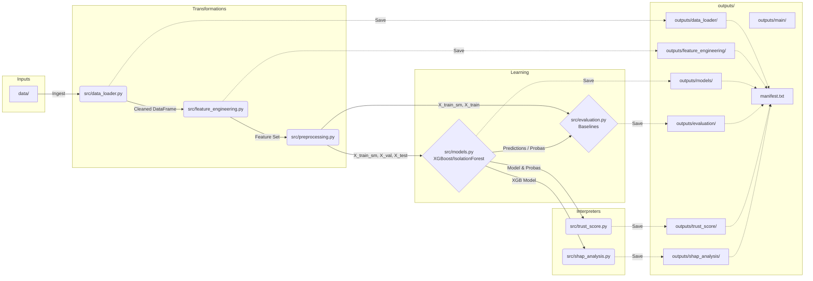

# System Architecture Document: Solana Trust Score Mitigation System

## System Overview
This system implements an end-to-end Machine Learning pipeline developed for the Solana Rug Pull Detection System (SolRPDS). The primary goal of the system is to calculate a composite **Trust Score (TS)** to evaluate the legitimacy of liquidity pools on the Solana blockchain and detect potential "rug pull" scams. It replicates and extends the ML backend architecture from an IEEE conference paper by extracting and evaluating historical on-chain features like transaction behaviors, tokenomics proxies, and liquidity metrics, evaluating them using a dual-layer XGBoost and Isolation Forest modeling approach.

## Component Breakdown
The pipeline is modularized into several decoupled sequence components:

* **Data Loader (`src/data_loader.py`)**: Responsible for locating, ingesting, and consolidating multi-year raw liquidity pool activity CSV datasets into a unified dataset dataframe. Generates an initial text data audit report tracking nulls, datatypes, and class balances.
* **Feature Engineering (`src/feature_engineering.py`)**: Transforms 12 raw on-chain tracking variables into 23 advanced predictive ML proxies. Calculates rolling temporal features (like `swap_to_close_gap_hours`), proxy ratios (like `liquidity_to_pool_ratio`), and absolute event flags representing potential hard rug signals.
* **Preprocessing & Splitting (`src/preprocessing.py`)**: Handles data quality constraints and model-ready shaping. Performs stratified undersampling on highly imbalanced target data to create manageable modeling subsets. Manages null imputation, scales continuous data utilizing a subset-fitted `MinMaxScaler`, and applies **SMOTE** exclusively to training sets.
* **Models (`src/models.py`)**: Hosts the primary fraud modeling infrastructure layers:
    * **XGBoost Classifier**: The primary supervised core predictive model. Hyperparameter-tuned via `GridSearchCV` across parameters like learning rate, sub-samples, and max depth targeting high F1 and AUC-ROC score yields.
    * **Isolation Forest**: An unsupervised anomaly detection layer that maps abstract multidimensional divergencies into secondary prediction vectors.
* **Evaluation & Baselines (`src/evaluation.py`)**: Trains baseline scientific comparative models (Random Forest, Logistic Regression). Calculates comprehensive metric comparisons (Precision, Recall, F1, AUC) and structures the output plots (ROC curves overlay, PR curves, Confusion Matrix heatmaps) comparing the XGBoost output against standard algorithm proxies.
* **SHAP Explainability (`src/shap_analysis.py`)**: Applies interpretability algorithms via `shap` against the black-box XGBoost model using `TreeExplainer` mechanisms. Generates feature importance charts, beeswarm directionality impacts, and individual feature waterfall visualizations for singular predictions.
* **Trust Score Engine (`src/trust_score.py`)**: A programmatic heuristics mapper. Maps XGBoost empirical fraud probabilities [0.0, 1.0] into a 0-100 Trust Score index rating (higher = safer) and assigns subsequent categorical risk tiers (`HIGH_RISK`, `MEDIUM_RISK`, `LOW_RISK`).
* **Main Orchestrator (`main.py`)**: The central routing execution process. Sequentially dispatches the lifecycle operations above, managing module data handoffs and system-wide persistent artifact exports (plots, logs, text reports) to specific nested directory endpoints.

## Data Flow
1. **Raw Inputs**: CSV files located in `solana_trust_score/data/` are fetched dynamically.
2. **Ingestion & Concatenation**: `data_loader.py` merges arrays, generates raw data structures, drops initial nulls, and eliminates duplicate pool tracking addresses.
3. **Engineering**: Temporal and relational variables are calculated. Null timeframes are corrected to 0. Raw token ID strings are dropped in favor of behavioral flags. Target columns map cleanly to ints (0=Legit, 1=Rug).
4. **Preprocessing**: Data separates strictly into `X_train`, `X_val`, `X_test` stratified splits. Continuous feature vectors process through the local scaler. Only `X_train` receives SMOTE amplification (becoming `X_train_sm`), while `X_val/test` arrays remain naturally scarce.
5. **Model Fitting**:
    - `X_train_sm` feeds into XGBoost (grid search evaluated).
    - `X_train_sm` feeds into Random Forest baselines.
    - `X_train` natively feeds Logistic Regression and Isolation Forests.
6. **Inference & Scoring**: `X_test` targets evaluate precision scoring across models. XGBoost probabilities pass independently to `TrustScore` mapping classes and SHAP evaluation functions.
7. **Artifact Export**: Every intermediate transformation (`.csv`), serialized algorithm logic (`.pkl`), metrics tables/reports (`.txt`, `.csv`), and plot blobs (`.png`) are pushed into designated `outputs/<script_name>` directories instead of root structures.

## Technology Stack
* **Language**: Python 3.10+
* **Data Processing Pipeline**: Pandas, NumPy
* **Machine Learning**:
    - `scikit-learn` (v1.3.*): Regression, Forests, Scaling, Splitters, Metrics, Isolation Forests, GridSearchCV
    - `xgboost` (v2.1+): Supervised Gradient Boosting Core
    - `imblearn`: SMOTE Target Oversampling
* **Explainability**: `shap` (specifically bypassing JSON model parsers through direct internal configuration patching)
* **Visualizations**: `matplotlib`, `seaborn`
* **Artifact Serialization**: `joblib`

## Directory / File Structure

```
├── .gitignore                        # Global ignore patterns
├── architecture.md                   # This current documentation reference
├── solana_trust_score/
│   ├── main.py                       # Core orchestrator pipeline script
│   ├── requirements.txt              # Standardized pip dependency map
│   ├── data/                         # Raw extracted CSV dataset root
│   ├── SolRPDS/                      # Original cloned data repository reference
│   ├── src/                          # Execution Logic Submodules
│   │   ├── data_loader.py            # Ingestion & Audit
│   │   ├── evaluation.py             # Baseline comparisons and plotting
│   │   ├── feature_engineering.py    # Base proxy engineering
│   │   ├── models.py                 # Core algorithmic modeling and grid search
│   │   ├── preprocessing.py          # Undersampling, SMOTE, Scaling
│   │   ├── shap_analysis.py          # Interpretability logic and graphs
│   │   └── trust_score.py            # Index Tier heuristics
│   └── outputs/                      # Saved persistent nested artifact structure
│       ├── manifest.txt              # Auto-generated textual listing mapping output relative paths
│       ├── data_loader/              # Stores data_audit.txt
│       ├── feature_engineering/      # Stores features_engineered.csv
│       ├── main/                     # Stores experiment_summary.txt, class distributions
│       ├── models/                   # Stores xgboost_best_model.pkl
│       ├── evaluation/               # Stores model comparison CSV and ROC/PR/CM plots
│       ├── shap_analysis/            # Stores Bar, Beeswarm, and Waterfall png plots
│       └── trust_score/              # Stores Trust score TS output tables and histograms
```

## External Interfaces
* **Dataset Dependencies**: Initially targets files stored via standard Git Clone operations sourced externally towards `https://github.com/DeFiLabX/SolRPDS.git`.
* **Output Artifact Persistence**: Employs `os.makedirs` and `plt.savefig()` headless plotting endpoints utilizing relative path routing internally isolated to the `outputs/` folder. Intentionally suppresses inline visual renders (`plt.show()`) ensuring CI/CD batch compatibility for output extraction and review.

## Dependencies & Constraints
* **Execution Order Dependency**: The structure operates within a strict synchronous pipe (Data > Engineering > Processing > Modeling > Scoring/Eval > Reporting). Each subsequent stage requires the full completion of the data return shapes preceding it.
* **XGBoost & SHAP Configurations**: Addressed a recognized parsing bug regarding XGBoost string types parsing inside the latest `shap` package implementations `[5E-1]`. Solved by directly patching string variables inside internal `get_booster().save_config()` strings, allowing XGBoost model shapes to process natively within the TreeExplainer.
* **Paper Metrics Fidelity Constraints**: While reaching robust validation metrics, some specific behavioral social features noted in the IEEE research (e.g. tracking freeze permissions logic via internal on-chain authorities directly) were restricted from SolRPDS logs, reducing the pipeline's max possible features from theoretical peak implementation ceilings.

## Mermaid Diagram



## Design Decisions & Rationale
1. **Strictly Segmented Output Paths**: During system iterations, all generated figures and models were explicitly wrapped out of root path dumps and mapped to independent tool-associated folders (e.g., `outputs/shap_analysis/` and `outputs/models/`). This isolates data artifacts allowing clean CI/CD extractions without repository contamination and enables holistic clearings via `rm -rf outputs/*`.
2. **SMOTE Isolation**: Configured boundary logic executing Synthetic Minority Over-sampling Technique (`SMOTE`) natively onto the test set exclusively post data splits. Scaling transforms and SMOTE augmentation arrays explicitly ignore Validations/Testing subframes providing empirically valid testing without synthetic leakage.
3. **Disabled Inline Outputs**: Overrode visual interaction calls (such as `plt.show()` inline) universally, allowing pipeline loops to function seamlessly in autonomous code execution environments. Figures were bound explicitly to explicit memory closures `plt.close()` immediately following disk serialization.
4. **Manifest Generation**: Appended a post-run `manifest.txt` document that catalogs output sizes, hierarchical structures, and metadata descriptors, rendering generated files highly readable for external verification bots referencing file blobs.

## Potential Improvements / Future Work
1. **Dynamic Real-Time Data Harvesting**: System proxies natively parse available historical constraints. Future architectures could tie API hooks directly into endpoints like Quicknode Solana streams fetching live target metrics (like freeze authority tags and LP tracking) updating features constantly to emulate paper targets entirely.
2. **FastAPI Scoring Microservice**: Abstract `main.py` out of CLI constraints and wrap the pipeline logic within a FastAPI server. Implementing a REST interface mapping `POST /score` to accept wallet strings, process them against cached models on the fly, and output Trust Score json.
