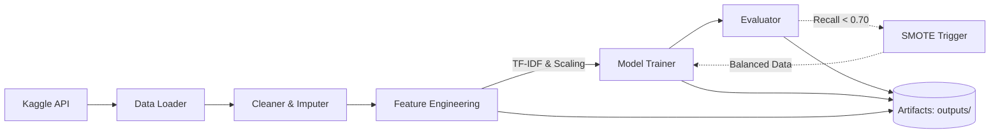

# System Architecture Document

## System Overview
The NOVA Classification ML Pipeline is an automated machine learning system designed to classify food products from the Open Food Facts dataset into their corresponding NOVA groups (1-4). The NOVA framework categorizes foods according to the extent and purpose of food processing, ranging from unprocessed (Group 1) to ultra-processed (Group 4). The system prioritizes precision in identifying NOVA 4 products, aiming to achieve high accuracy while providing a reproducible, end-to-end data processing and model training workflow.

## Component Breakdown
1. **Data Loader (`load_and_explore_data`)**: Responsible for fetching the raw Open Food Facts TSV dataset via the Kaggle API and loading it into a Pandas DataFrame for processing.
2. **Feature Selector (`select_features`)**: Filters the massive dataset to retain only essential features, specifically text ingredients, additive counts, and key nutritional macronutrients.
3. **Data Cleaner (`clean_and_impute`)**: Handles missing data by applying median imputation to numerical features and empty string replacement for text data. It also manages duplicates and caps extreme outliers at the 99th percentile to improve model robustness.
4. **Feature Engineer (`feature_engineering_and_split`)**: Transforms raw data into machine learning-ready formats. It applies `TfidfVectorizer` to extract NLP features from ingredient texts and `StandardScaler` to normalize numeric nutritional data, subsequently stacking them into a unified feature matrix.
5. **Model Evaluator (`evaluate_model`)**: Calculates performance metrics including Accuracy, Macro F1, and class-specific precision/recall scores. It validates the priority metric (NOVA 4 Precision) and generates confusion matrix heatmaps.
6. **Model Trainer (`train_and_evaluate`)**: Orchestrates the training of three distinct models (Random Forest, XGBoost, and a Multi-Layer Perceptron), integrates SMOTE for handling class imbalance if recall thresholds are not met, and extracts feature importances.

## Data Flow
1. **Input**: Raw TSV data is downloaded dynamically from Kaggle.
2. **Transformation**: The data passes through selection, imputation, text vectorization (TF-IDF), and numerical scaling.
3. **Execution**: The transformed matrix is split (80/20 stratified) and fed into the classification models.
4. **Output/Persistence**: Trained models (`.pkl`), data preprocessors (`scaler.pkl`, `tfidf_vectorizer.pkl`), performance metrics (`results_summary.csv`), and visualizations (`.png` matrices) are persisted to the local `./outputs/run_pipeline/` directory. A `manifest.txt` file is generated detailing the output payload.

## Technology Stack
- **Language**: Python 3.10+
- **Data Manipulation**: Pandas, NumPy
- **Machine Learning**: Scikit-learn (RandomForest, MLP, TF-IDF, StandardScaler), XGBoost (XGBClassifier)
- **Data Balancing**: Imbalanced-learn (SMOTE)
- **Data Sourcing**: Kagglehub API
- **Visualization**: Matplotlib, Seaborn

## Directory / File Structure
```
.
├── architecture.md           # This system architecture document
├── run_pipeline.py           # The main end-to-end pipeline script
└── outputs/
    ├── manifest.txt          # Inventory of generated output files
    └── run_pipeline/         # Dedicated script output directory
        ├── best_model.pkl    # Serialized best-performing ML model
        ├── scaler.pkl        # Serialized numerical scaler
        ├── tfidf_vectorizer.pkl # Serialized NLP vectorizer
        ├── results_summary.csv  # Tabular performance metrics
        └── *.png             # Confusion matrices and feature importances
```

## External Interfaces
- **Kaggle API**: The system relies on `kagglehub` to authenticate and seamlessly download the `openfoodfacts/world-food-facts` dataset.
- **Disk I/O**: The system writes substantial binary (models) and image artifacts directly to the local filesystem.

## Dependencies & Constraints
- **Execution Order**: Feature extraction must strictly follow imputation, and SMOTE can only be triggered *after* initial model evaluations determine baseline recall metrics.
- **Environment**: Requires `low_memory=False` for Pandas CSV parsing due to the ~1GB dataset size.
- **Constraints**: Scikit-learn, XGBoost, and Imbalanced-learn must be installed in the runtime environment. Python versions must be 3.10 or higher.

## High-Level Architecture Diagram


## Design Decisions & Rationale
1. **Dynamic Data Fetching**: Utilized `kagglehub` to fetch the Open Food Facts dataset directly instead of relying on manual downloads, ensuring the pipeline remains reproducible across environments.
2. **Feature Engineering Stack**: Chose to combine NLP (TF-IDF on ingredients) with numerical data (macronutrients) using `scipy.sparse.hstack`. This multi-modal approach leverages both the literal composition and structural contents of the food items.
3. **Imputation Strategy**: Numeric missing values are filled with the column median instead of the mean to prevent distortion from extreme nutritional outliers, which are common in food databases.
4. **SMOTE Trigger**: Rather than defaulting to synthetic oversampling, SMOTE is applied conditionally only if minority class recall (NOVA 2 or 3) falls below 0.70. This prevents unnecessary distortion of the training space when the natural distribution yields sufficient predictive power.
5. **Output Routing**: Hardcoded all persistence commands to target `./outputs/run_pipeline/` to comply with architectural constraints that require clean, manifest-tracked output isolation.

## Potential Improvements / Future Work
- **Hyperparameter Tuning**: Current models use static parameters (e.g., `n_estimators=200`, `max_depth=20` for RF). Implementing `GridSearchCV` or `Optuna` could yield better accuracy and precision metrics.
- **Advanced NLP**: Upgrading from TF-IDF to transformer-based embeddings (like BERT) for the `ingredients_text` might capture deeper semantic relationships between additive names and processing levels.
- **Incremental Learning**: Given the 1GB+ size of the dataset, transitioning to chunk-based processing or using frameworks like Dask could significantly reduce RAM overhead.
