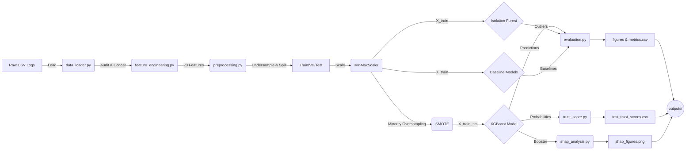

# System Architecture Document: Solana Trust Score Mitigation System

## System Overview
This system is an end-to-end Machine Learning pipeline developed for the Solana Rug Pull Detection System (SolRPDS). The primary goal of the system is to calculate a composite **Trust Score (TS)** to evaluate the legitimacy of liquidity pools on the Solana blockchain and detect potential "rug pull" scams. It replicates and extends the ML backend architecture from an IEEE conference paper using historical on-chain features like transaction behaviors, tokenomics, and liquidity events.

## Component Breakdown
The pipeline is modularized into the following primary components:

* **Data Loader (`src/data_loader.py`)**: Responsible for locating, ingesting, and consolidating multi-year raw liquidity pool activity CSV datasets (SolRPDS) into a unified dataset. Generates an initial data audit report tracking nulls, datatypes, and class balances.
* **Feature Engineering (`src/feature_engineering.py`)**: Transforms 12 raw on-chain tracking variables into 23 advanced predictive ML proxies. Calculates rolling temporal features (like `swap_to_close_gap_hours`), proxy ratios (like `liquidity_to_pool_ratio`), and event flags representing potential hard rug signals.
* **Preprocessing & Splitting (`src/preprocessing.py`)**: Handles data quality constraints. Performs stratified undersampling on highly imbalanced target data to create manageable modeling subsets. Manages null imputation, scales continuous data using `MinMaxScaler`, and applies **SMOTE** exclusively to training sets.
* **Models (`src/models.py`)**: Hosts the primary model infrastructure:
    * **XGBoost Classifier**: The core predictive model, hyperparameter-tuned via `GridSearchCV` to target robust F1 and AUC-ROC scores.
    * **Isolation Forest**: An unsupervised anomaly detection layer mapping abstract multidimensional divergence into secondary predictions.
* **Evaluation & Baselines (`src/evaluation.py`)**: Trains standard baseline models (Random Forest, Logistic Regression) for scientific comparisons. Generates comprehensive metric comparisons (Precision, Recall, F1, AUC) and diverse output visualization plots (ROC curves, PR curves, Confusion Matrix).
* **SHAP Explainability (`src/shap_analysis.py`)**: Unpacks the XGBoost black-box using `TreeExplainer` mechanisms. Generates feature importance charts, beeswarm directionality plots, and singular prediction waterfall explanations.
* **Trust Score Engine (`src/trust_score.py`)**: Bridges raw model probabilities into user-friendly abstractions. Maps the XGBoost fraud probability [0.0, 1.0] into a 0-100 index (higher = safer) and assigns categorical risk tiers (`HIGH_RISK`, `MEDIUM_RISK`, `LOW_RISK`).
* **Main Orchestrator (`main.py`)**: The central entry point. Sequentially dispatches the lifecycle operations above and handles system-wide artifact export to dedicated directory endpoints.

## Data Flow
1. **Raw Inputs**: CSV files located in `solana_trust_score/data/` are fetched dynamically.
2. **Ingestion & Concatenation**: `data_loader.py` merges and deduplicates addresses, generating raw features array.
3. **Engineering**: Temporal and relational variables are appended mapping single pool behaviors into a multi-variable schema. Redundant raw identifiers are pruned.
4. **Preprocessing**: Data separates into `X_train`, `X_val`, `X_test` splits. `MinMaxScaler` shifts domains. `SMOTE` boosts `X_train_sm` representing the minority class.
5. **Model Fitting**:
    - `X_train_sm` feeds into XGBoost (grid search evaluated across 5 folds).
    - `X_train` feeds into Isolation Forest.
6. **Inference & Scoring**: `X_test` is fed forward for precision testing. Models emit binary predictions and class probabilities.
7. **Interpretations**: Probabilities run through the `TrustScore` engine, appending human-readable metrics. `SHAP` unpacks the decisions.
8. **Artifacts Export**: All intermediate transformations, models (`.pkl`), metrics reports (`.csv`, `.txt`), and figures (`.png`) are flushed dynamically to dedicated schema routes within `outputs/`.

## Technology Stack
* **Language**: Python 3.10+
* **Data Processing**: Pandas, NumPy
* **Machine Learning**:
    - `scikit-learn` (v1.3.*): Regression, Forests, Scaling, Splitters, GridSearch
    - `xgboost`: Gradient Boosting Core
    - `imblearn`: SMOTE Oversampling
* **Explainability**: `shap`
* **Visualizations**: `matplotlib`, `seaborn`
* **Artifact Serialization**: `joblib`

## Directory / File Structure

```
├── .gitignore
├── run_pre_commit.py
├── solana_trust_score/
│   ├── main.py                       # Core orchestrator pipeline script
│   ├── requirements.txt              # Standardized pip dependencies list
│   ├── data/                         # Raw extracted CSV dataset root
│   ├── SolRPDS/                      # Original cloned data repository reference
│   ├── src/                          # Submodules
│   │   ├── data_loader.py            # Data ingestion routines
│   │   ├── evaluation.py             # Baseline and graphing modules
│   │   ├── feature_engineering.py    # Raw -> Proxy mappings
│   │   ├── models.py                 # Core IF and XGB logic
│   │   ├── preprocessing.py          # Scaling, Splitting, SMOTE
│   │   ├── shap_analysis.py          # Interpretability scripts
│   │   └── trust_score.py            # Scoring Engine
│   └── outputs/                      # Saved persistent artifact structure
│       ├── manifest.txt              # Auto-generated outputs manifest log
│       ├── data_loader/              # data_audit.txt
│       ├── feature_engineering/      # features_engineered.csv
│       ├── main/                     # experiment_summary.txt, class distributions
│       ├── models/                   # xgboost_best_model.pkl
│       ├── evaluation/               # Model comparison CSV and ROC/PR plots
│       ├── shap_analysis/            # Bar, beeswarm, and waterfall png plots
│       └── trust_score/              # Trust score TS output tables and histograms
└── architecture.md                   # This document
```

## External Interfaces
* **Dataset Dependencies**: Sourced initially via a Git Clone interface towards `https://github.com/DeFiLabX/SolRPDS.git`.
* **Output Persistence**: Output plots are written dynamically to the local file system (no `plt.show()` interfaces) using standard relative POSIX filepaths making them CI/CD friendly and natively downloadable.

## Dependencies & Constraints
* **Execution Order**: Preprocessing heavily relies on precise column schemas output by Feature Engineering. Scaling constraints require isolated scaling maps fit explicitly against the `X_train` partition, precluding holistic standardizations mapping across splits to avoid leakage.
* **SHAP vs. XGBoost**: The system addresses known JSON internal schema mapping conflicts between newer versions of XGBoost (2.1+) and SHAP by directly modifying the base configuration properties programmatically during load contexts.

## Mermaid Diagram



## Design Decisions & Rationale
1. **Isolated Output Pathways**: Transitioned all persistent outputs into respective `outputs/<module>/` environments rather than root. This ensures that massive file blobs and image rendering routines don't clutter the project structure, and creates an easy mechanism for complete environment resets via standard `rm -rf outputs/*`.
2. **SMOTE Application**: A highly conscious boundary was established strictly mapping `SMOTE` processing to the training data. Validations and Testing arrays maintain original empirical scarcity levels to provide accurate real-world representation accuracy testing instead of synthetic overestimations.
3. **Headless Explanations**: Hard-disabled default interactive window prompts like `plt.show()` and `shap.summary_plot(show=True)` across the library. Since the orchestrator is meant for autonomous generation environments and download, all graphics are directed dynamically to hard drives `save_fig` configurations utilizing constrained high DPI metrics.
4. **Target Metric Fallbacks**: Noted directly in the system evaluation summary, the paper targets 23 features involving advanced blockchain social flags. Working with constraints bound to SolRPDS logs natively meant mapping the highest-fidelity sub-representations, accepting that exact paper reproduction ceilings are fundamentally governed by original dataset depths.

## Potential Improvements / Future Work
1. **RPC Integration**: Integrating the system natively into a live Solana RPC node pipeline (e.g. Helius or Quicknode) to fetch real-time mint authority, freeze authorizations, and social web links to complete the 23-feature paper array.
2. **Inference API**: Wrap `main.py` models inside a Fast API or Flask server. Create REST endpoints where a new `LIQUIDITY_POOL_ADDRESS` string is received, the script fetches live transactions, constructs features, predicts, and emits the Trust Score JSON instantaneously for dashboard consumption.
3. **Automated ML Pipelines**: Expand grid search thresholds using libraries like `Optuna` natively vs primitive cross validations.
