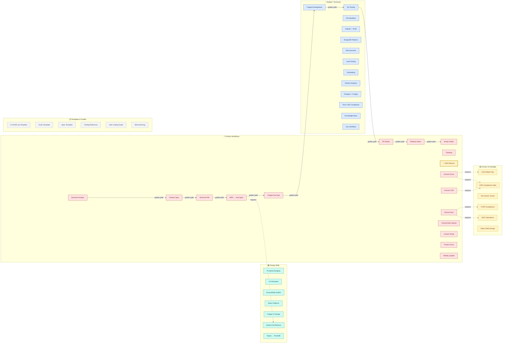
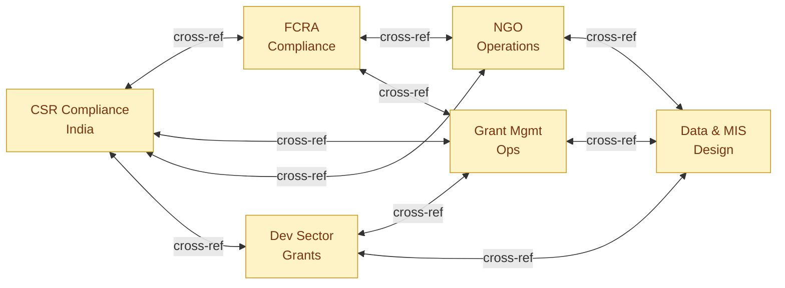
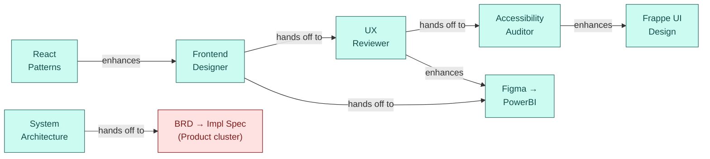

# DRIS Skill Graph

> Interactive version: [**skill-graph.html**](./skill-graph.html) · Data index: [**SKILL_GRAPH.json**](./SKILL_GRAPH.json)

## Overview — All Clusters

---

## ⭐ The Golden Path — Client Call to Shipped Code

```mermaid
graph TD
    START((Client Call)) --> BA["1️⃣ Business Analyst<br/><i>BRD + Requirements Matrix</i>"]
    BA --> FS["2️⃣ Feature Spec<br/><i>.docx spec</i>"]
    FS --> TPM["3️⃣ Technical PM<br/><i>Solution architecture (COVE)</i>"]
    TPM --> BIS["4️⃣ BRD → Impl Spec<br/><i>Claude Code-ready tech spec</i>"]
    BIS --> CTX{{"Load Domain Context<br/><i>mGrant Donor / CSR / NuO<br/>+ compliance skills</i>"}}
    CTX --> FDT["5️⃣ Frappe DocType<br/><i>JSON + workflows</i>"]
    FDT --> FRD["6️⃣ Frappe Development<br/><i>Production code</i>"]
    FRD --> DRC{{"Design Review Chain<br/><i>Frontend Designer → UX Reviewer<br/>→ Accessibility Auditor</i>"}}
    DRC --> QA["7️⃣ QA Testing<br/><i>E2E + POM</i>"]
    QA --> PR["8️⃣ PR Raiser<br/><i>GitHub PR</i>"]
    PR --> RN["9️⃣ Release Notes<br/><i>Internal + customer</i>"]
    RN --> ED["🔟 Email Drafter<br/><i>Client update</i>"]
    ED --> DONE((Shipped ✓))

    style START fill:#C8991F,stroke:#8B1A1A,color:white
    style DONE fill:#16a34a,stroke:#166534,color:white
    style CTX fill:#FEF3C7,stroke:#C8991F,color:#78350F
    style DRC fill:#CCFBF1,stroke:#2D6A6A,color:#134E4A
    style BA fill:#FEE2E2,stroke:#8B1A1A,color:#7F1D1D
    style FS fill:#FEE2E2,stroke:#8B1A1A,color:#7F1D1D
    style TPM fill:#FEE2E2,stroke:#8B1A1A,color:#7F1D1D
    style BIS fill:#FEE2E2,stroke:#8B1A1A,color:#7F1D1D
    style FDT fill:#FEE2E2,stroke:#8B1A1A,color:#7F1D1D
    style FRD fill:#DBEAFE,stroke:#1E40AF,color:#1E3A5F
    style QA fill:#DBEAFE,stroke:#1E40AF,color:#1E3A5F
    style PR fill:#FEE2E2,stroke:#8B1A1A,color:#7F1D1D
    style RN fill:#FEE2E2,stroke:#8B1A1A,color:#7F1D1D
    style ED fill:#FEE2E2,stroke:#8B1A1A,color:#7F1D1D
```

---

## Domain Knowledge Cluster (6 skills)

---

## Design Skills Cluster (7 skills)

---

## Entry Points by Role

| I am a… | Start with | What it does |
|---------|-----------|-------------|
| **Product Manager** | `dris-feature-spec` or `dris-skill-selector` | Spec a feature or get routed to the right skill |
| **Business Analyst** | `dris-business-analyst` | Structure client calls/emails into BRD |
| **Engineer** | `frappe-development` or `brd-to-implementation-spec` | Build from specs with battle-tested patterns |
| **QA Engineer** | `qa-testing` or `ux-reviewer` | E2E testing or UI quality review |
| **Designer** | `frontend-designer` or `figma-to-powerbi` | Build UI or convert Figma → PowerBI |
| **Leadership** | `dris-skill-selector` | Understand the ecosystem |

---

## Contributors

| Person | Affiliation | Contribution |
|--------|------------|-------------|
| **Affaan Mustafa** | Community | Everything Claude Code — 120+ base skills, hooks, commands, agents |
| **Nihaan Mohammed** | Dhwani RIS | 28 skills — domain (6), design (6), product workflows (16) |
| **Ankit Jangir** | Dhwani RIS | 13 technical skills, 2 Frappe agents, 5 rules, safety guardrails |
| **Swapnil Agarwal** | Dhwani RIS | BRD-to-implementation-spec, spec template, tooling reference |

---

*For the interactive visualization, see [`docs/skill-graph.html`](./skill-graph.html). For the machine-readable index, see [`docs/SKILL_GRAPH.json`](./SKILL_GRAPH.json).*
