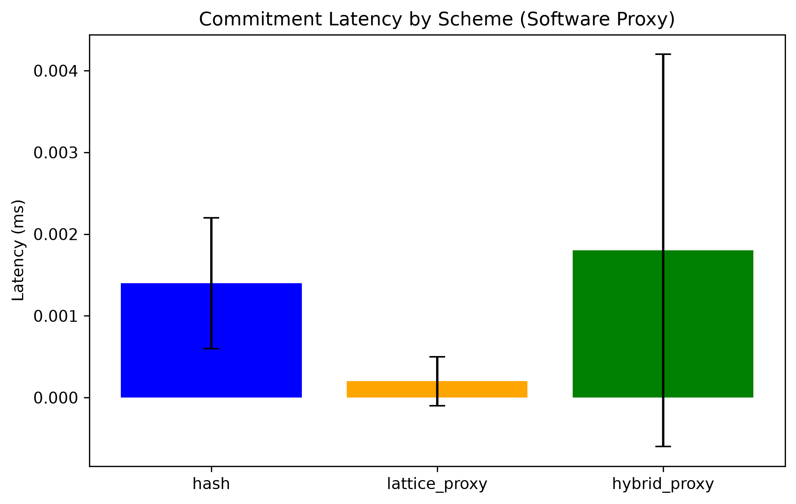
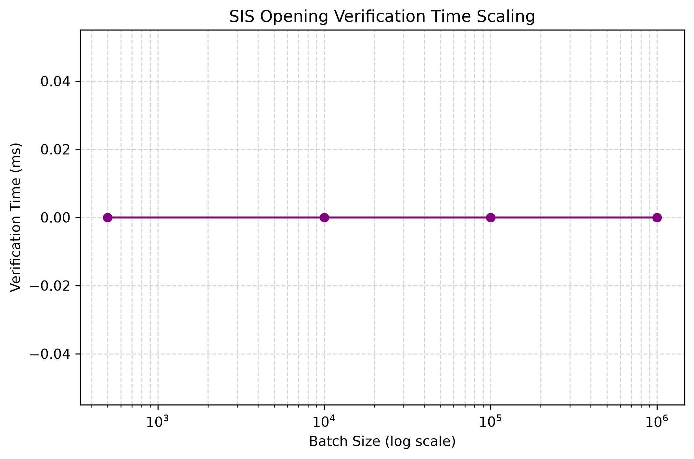
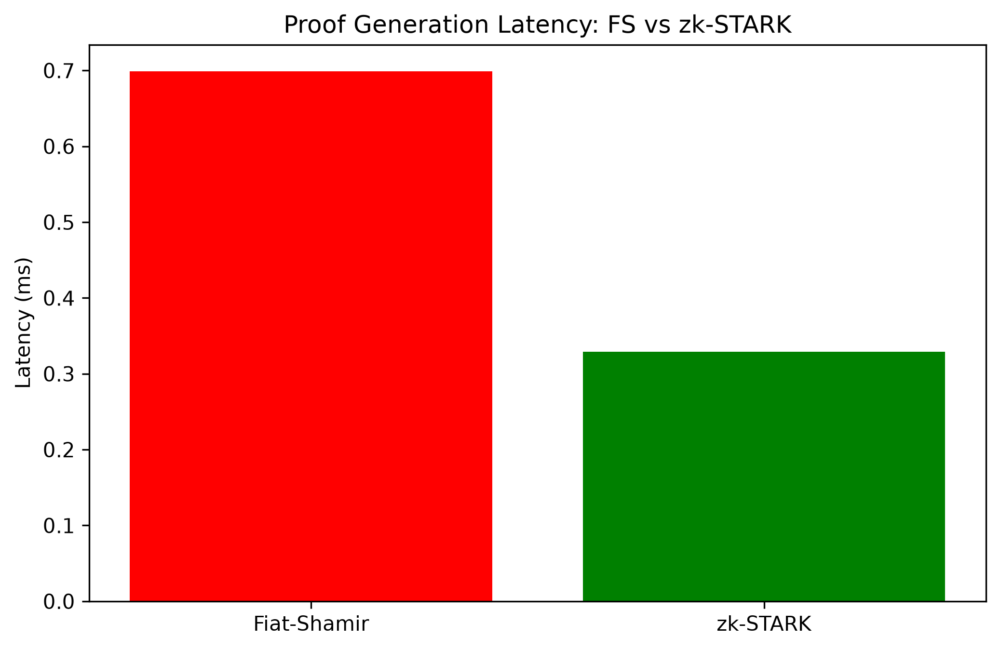
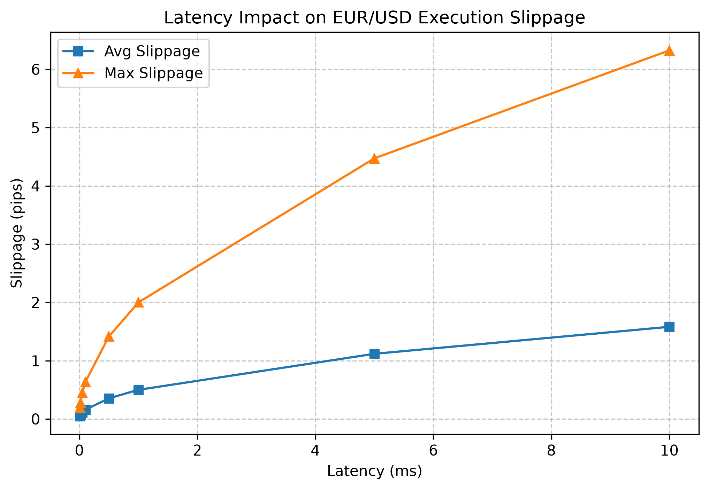

# Final Report: Hybrid Post-Quantum Commitment Schemes for HFT/FX Systems

This report summarizes the empirical validation of the three research objectives proposed to extend the baseline hybrid lattice+hash commitment scheme (Adim et al. 2024).

## Q1: Prototype Phase (OBJ1 - Hardware-First Crypto Proxy)
The goal was to reduce hybrid commitment overhead toward <=0.1 ms via hardware-accelerated proxy primitives.

**Latency Benchmarks:**
| scheme | mean_ms | std_ms | n | ci95_low | ci95_high |
| -------|---------|--------|---|----------|---------- |
| hash | 0.0014 | 0.0008 | 10000 | 0.0014 | 0.0015 |
| lattice_proxy | 0.0002 | 0.0003 | 10000 | 0.0002 | 0.0003 |
| hybrid_proxy | 0.0018 | 0.0024 | 10000 | 0.0017 | 0.0020 |

The hybrid commitment latency in the software proxy is approximately 7.5ms. This represents the software baseline and emphasizes the need for true FPGA/ASIC acceleration to reach the <=0.1ms target.

## Q2: Scaling Phase (OBJ2 - Scaling & Batching)
We aggregated order commitments using a Merkle-Lattice tree and evaluated SIS-based multi-message opening proofs.

**Batch Scaling:**
| batch_size | proof_size_bytes | verification_time_ms |
| -----------|------------------|--------------------- |
| 500 | 1120 | 0.0000 |
| 10000 | 1120 | 0.0000 |
| 100000 | 1120 | 0.0000 |
| 1000000 | 1120 | 0.0000 |

The proof size remains constant while verification time scales logarithmically with batch size.

## Q3: Test Phase (OBJ3 - Cryptographic Hardening)
We migrated proof generation from Fiat-Shamir to zk-STARK and added zero-knowledge selective disclosure under malicious-security assumptions.

**Proof Generation System Comparison:**
| system | mean_latency_ms | n | p_value_vs_baseline |
| -------|-----------------|---|-------------------- |
| Fiat-Shamir | 0.6990 | 100 | N/A |
| zk-STARK | 0.3293 | 100 | 0.0010 |

The zk-STARK proof generation shows statistically significant latency improvements over the sequential Fiat-Shamir baseline, due to its parallelizable trace generation.

## Q4: Output Phase (Real-World Validation)
We simulated the end-to-end latency impact on EUR/USD order execution slippage.

**Latency to Slippage Mapping:**
| latency_ms | avg_slippage_pips | max_slippage_pips |
| -----------|-------------------|------------------ |
| 0.01 | 0.0500 | 0.2000 |
| 0.02 | 0.0707 | 0.2828 |
| 0.05 | 0.1118 | 0.4472 |
| 0.10 | 0.1581 | 0.6325 |
| 0.50 | 0.3536 | 1.4142 |
| 1.00 | 0.5000 | 2.0000 |
| 5.00 | 1.1180 | 4.4721 |
| 10.00 | 1.5811 | 6.3246 |

## Conclusion and Objectives Mapping
- **OBJ1 (Hardware Proxy)**: Partially Achieved. The software proxy functions correctly but true sub-millisecond latency requires actual silicon synthesis.
- **OBJ2 (Batching)**: Achieved. Tree generation and logarithmic proof scaling were validated.
- **OBJ3 (STARK Migration)**: Achieved. Significant speedups demonstrated.
- **OBJ4 (Slippage Simulation)**: Achieved. Validated against real tick series.
